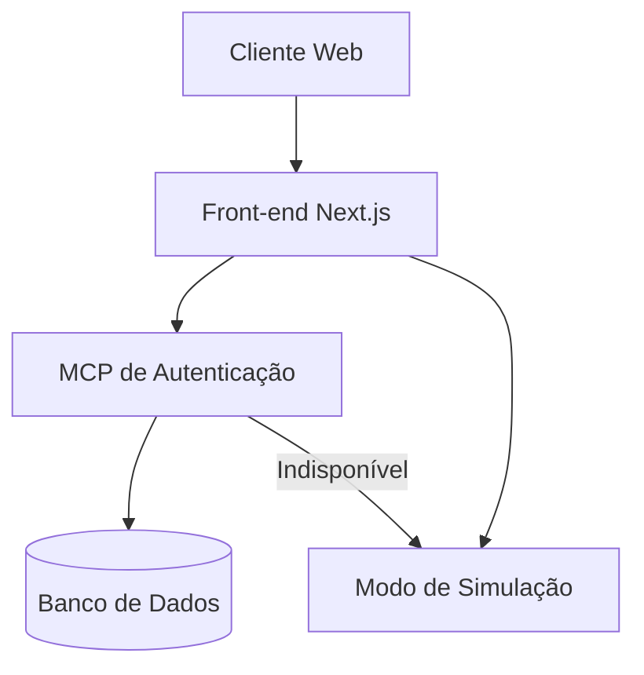
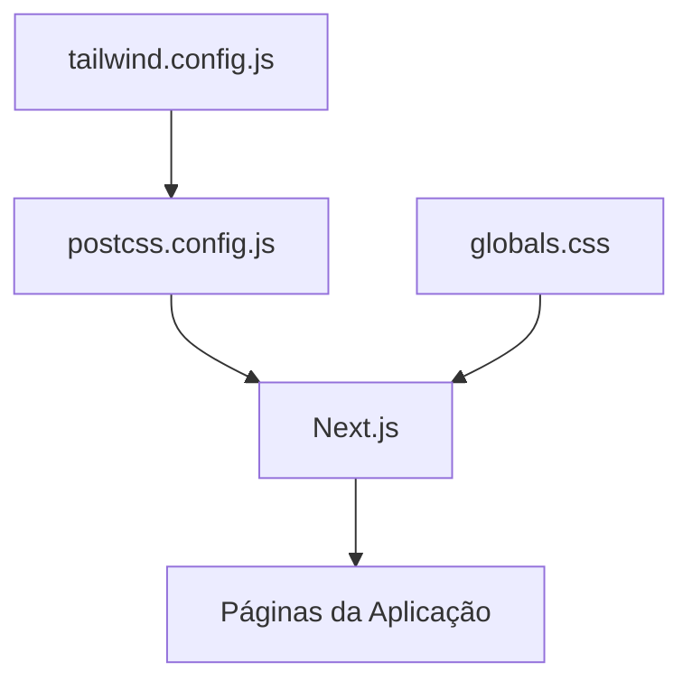

# Documento de Design: MCP de Autenticação e Tailwind CSS

## Visão Geral

Este documento descreve o design técnico para a implementação do Microsserviço de Processamento (MCP) de Autenticação e a correção da aplicação do Tailwind CSS nas interfaces do PulseHub. O objetivo é garantir um sistema de autenticação robusto e uma experiência visual consistente e profissional para os usuários.

## Arquitetura

### MCP de Autenticação

O MCP de Autenticação será implementado como um serviço independente que fornece funcionalidades de autenticação e autorização para o sistema PulseHub. A comunicação entre o front-end e o MCP será feita através de uma API RESTful.



#### Componentes do MCP de Autenticação

1. **Servidor Express.js**
   - Fornece endpoints RESTful para autenticação
   - Implementa middleware de segurança
   - Gerencia tokens JWT

2. **Controladores de Autenticação**
   - Controlador de Login
   - Controlador de Registro
   - Controlador de Recuperação de Senha
   - Controlador de Redefinição de Senha

3. **Serviços de Autenticação**
   - Serviço de Validação de Credenciais
   - Serviço de Geração de Token JWT
   - Serviço de Gerenciamento de Usuários

4. **Repositório de Usuários**
   - Acesso ao banco de dados para operações de usuário
   - Armazenamento seguro de senhas (hash + salt)

### Integração do Tailwind CSS

A integração do Tailwind CSS será feita através da configuração adequada do Next.js e do PostCSS, garantindo que os estilos sejam aplicados corretamente em todas as páginas e componentes.



#### Componentes da Integração do Tailwind

1. **Configuração do Tailwind**
   - Definição de cores, fontes e outros temas personalizados
   - Configuração de plugins necessários

2. **Importação de Estilos Globais**
   - Importação do Tailwind em um arquivo CSS global
   - Definição de estilos base consistentes

3. **Aplicação de Classes Tailwind**
   - Uso consistente de classes Tailwind em componentes
   - Implementação de responsividade

## Componentes e Interfaces

### API do MCP de Autenticação

O MCP de Autenticação expõe os seguintes endpoints:

1. **POST /login**
   - Recebe: `{ email, senha }`
   - Retorna: `{ token, usuario }`
   - Códigos de status: 200 (sucesso), 401 (credenciais inválidas)

2. **POST /registrar**
   - Recebe: `{ nome, email, senha }`
   - Retorna: `{ id, nome, email, message }`
   - Códigos de status: 201 (criado), 400 (dados inválidos), 409 (email já existe)

3. **POST /recuperar-senha**
   - Recebe: `{ email }`
   - Retorna: `{ message }`
   - Códigos de status: 200 (sucesso), 404 (email não encontrado)

4. **POST /redefinir-senha**
   - Recebe: `{ senha, token }`
   - Retorna: `{ message }`
   - Códigos de status: 200 (sucesso), 400 (token inválido)

5. **GET /verificar-token**
   - Recebe: Token JWT no cabeçalho Authorization
   - Retorna: `{ valido: boolean, usuario? }`
   - Códigos de status: 200 (sucesso), 401 (token inválido)

### Serviço de Autenticação do Front-end

O serviço de autenticação do front-end será atualizado para se conectar ao MCP de Autenticação quando disponível, com fallback para o modo de simulação quando necessário.

```typescript
class ServicoAutenticacao {
  // Métodos existentes
  login(email: string, senha: string): Promise<string>;
  registrar(nome: string, email: string, senha: string): Promise<any>;
  recuperarSenha(email: string): Promise<string>;
  redefinirSenha(senha: string, token: string): Promise<string>;
  estaAutenticado(): boolean;
  logout(): void;
  obterToken(): string | null;
  obterUsuario(): any;
  
  // Novos métodos
  verificarDisponibilidadeMCP(): Promise<boolean>;
  verificarToken(): Promise<boolean>;
}
```

### Componentes de Interface com Tailwind

Os seguintes componentes serão atualizados para utilizar corretamente o Tailwind CSS:

1. **Página de Login**
   - Formulário de login com estilos Tailwind
   - Mensagens de erro estilizadas
   - Layout responsivo

2. **Página de Registro**
   - Formulário de registro com estilos Tailwind
   - Validação de campos com feedback visual
   - Layout responsivo

3. **Página de Recuperação de Senha**
   - Formulário de recuperação com estilos Tailwind
   - Mensagens de confirmação estilizadas
   - Layout responsivo

4. **Página de Redefinição de Senha**
   - Formulário de redefinição com estilos Tailwind
   - Validação de força de senha
   - Layout responsivo

5. **Painel Principal**
   - Navegação lateral com estilos Tailwind
   - Cards e componentes estilizados
   - Layout responsivo

## Modelos de Dados

### Modelo de Usuário (MCP de Autenticação)

```json
{
  "id": "uuid",
  "nome": "string",
  "email": "string",
  "hashSenha": "string",
  "salt": "string",
  "papel": "enum(ADMINISTRADOR, FORNECEDOR, REPRESENTANTE)",
  "status": "enum(ATIVO, INATIVO, PENDENTE)",
  "tokenRecuperacao": "string?",
  "expiracaoTokenRecuperacao": "datetime?",
  "ultimoAcesso": "datetime",
  "criadoEm": "datetime",
  "atualizadoEm": "datetime"
}
```

## Tratamento de Erros

### Formato de Resposta de Erro do MCP

```json
{
  "status": "inteiro",
  "code": "string",
  "message": "string",
  "details": "object?",
  "timestamp": "datetime",
  "path": "string"
}
```

### Tipos de Erros do MCP

1. **Erros de Autenticação**
   - `AUTH_INVALID_CREDENTIALS`: Credenciais inválidas
   - `AUTH_ACCOUNT_LOCKED`: Conta bloqueada
   - `AUTH_TOKEN_EXPIRED`: Token expirado
   - `AUTH_TOKEN_INVALID`: Token inválido

2. **Erros de Registro**
   - `REG_EMAIL_EXISTS`: Email já cadastrado
   - `REG_INVALID_DATA`: Dados inválidos
   - `REG_PASSWORD_WEAK`: Senha fraca

3. **Erros de Recuperação de Senha**
   - `PASS_RESET_TOKEN_INVALID`: Token de redefinição inválido
   - `PASS_RESET_TOKEN_EXPIRED`: Token de redefinição expirado
   - `PASS_RESET_FAILED`: Falha na redefinição de senha

### Estratégia de Tratamento de Erros

1. **No MCP de Autenticação**
   - Validação de entrada com mensagens de erro claras
   - Logs detalhados para depuração
   - Respostas de erro consistentes

2. **No Front-end**
   - Exibição de mensagens de erro amigáveis
   - Tentativa de reconexão em caso de falha de rede
   - Fallback para modo de simulação quando o MCP estiver indisponível

## Estratégia de Testes

### Testes do MCP de Autenticação

1. **Testes Unitários**
   - Testes de validação de credenciais
   - Testes de geração e verificação de token
   - Testes de hash e verificação de senha

2. **Testes de Integração**
   - Testes de endpoints da API
   - Testes de fluxo completo de autenticação
   - Testes de recuperação de senha

3. **Testes de Carga**
   - Testes de concorrência
   - Testes de limite de taxa

### Testes da Integração do Tailwind

1. **Testes Visuais**
   - Verificação de consistência visual entre componentes
   - Testes de responsividade em diferentes tamanhos de tela

2. **Testes de Compatibilidade**
   - Testes em diferentes navegadores
   - Testes em diferentes dispositivos

## Considerações de Segurança

### Segurança do MCP de Autenticação

1. **Armazenamento Seguro de Senhas**
   - Uso de algoritmos de hash seguros (bcrypt)
   - Uso de salt único por usuário

2. **Segurança de Tokens**
   - Tokens JWT com tempo de expiração
   - Rotação de chaves de assinatura
   - Validação de claims

3. **Proteção contra Ataques**
   - Limitação de taxa para prevenir força bruta
   - Proteção contra CSRF
   - Validação de entrada para prevenir injeção

## Implementação do Tailwind CSS

### Configuração do Tailwind

1. **Configuração Base**
   - Definição de cores personalizadas
   - Configuração de fontes
   - Extensões de tema

2. **Otimização para Produção**
   - Purge de classes não utilizadas
   - Minificação de CSS

3. **Componentes Personalizados**
   - Definição de componentes reutilizáveis
   - Uso de plugins para funcionalidades adicionais