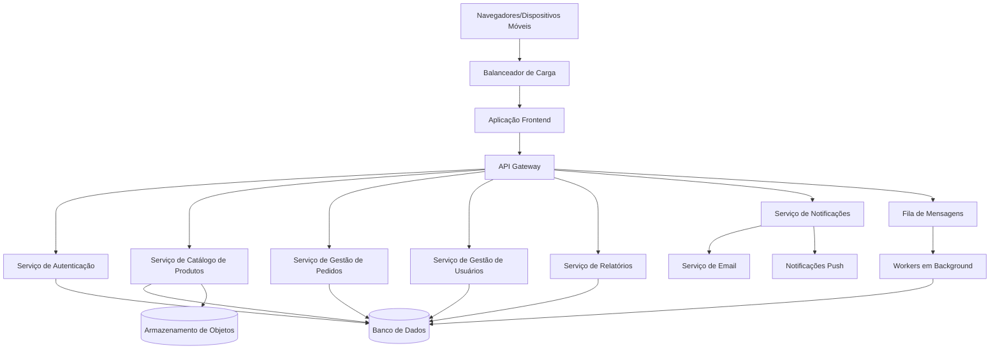

# Documento de Design: Plataforma B2B PulseHub

## Visão Geral

PulseHub é uma plataforma B2B que conecta fornecedores de moda e representantes comerciais, permitindo a gestão digital de catálogos, pedidos e relacionamentos comerciais. Este documento de design descreve a arquitetura técnica, componentes, modelos de dados e estratégias de implementação para a plataforma.

## Arquitetura

### Arquitetura do Sistema

O PulseHub será construído usando uma arquitetura moderna e escalável com os seguintes componentes principais:

1. **Aplicação Frontend**
   - Aplicação web construída com React.js
   - Recursos de Progressive Web App (PWA) para acessibilidade móvel
   - Design responsivo para interfaces desktop e móveis

2. **Serviços Backend**
   - API RESTful Node.js/Express.js
   - Arquitetura de microsserviços para escalabilidade
   - Serviço de autenticação usando tokens JWT
   - Serviço de catálogo de produtos
   - Serviço de gestão de pedidos
   - Serviço de gestão de usuários e clientes
   - Serviço de relatórios e análises
   - Serviço de notificações

3. **Camada de Banco de Dados**
   - Banco de dados principal: PostgreSQL para dados relacionais
   - Redis para cache e gerenciamento de sessões
   - Armazenamento de objetos (AWS S3 ou equivalente) para imagens de produtos e arquivos

4. **Camada de Integração**
   - API Gateway para integrações externas
   - Sistema de filas de mensagens (RabbitMQ) para processamento assíncrono
   - Sistema de webhooks para notificações em tempo real

### Arquitetura de Implantação

O sistema será implantado usando conteinerização para consistência entre ambientes:

- Contêineres Docker para todos os serviços
- Kubernetes para orquestração
- Pipeline de CI/CD para testes e implantação automatizados
- Ambientes separados para desenvolvimento, homologação e produção



## Componentes e Interfaces

### Componentes de Interface do Usuário

1. **Interfaces de Autenticação**
   - Tela de login
   - Formulário de registro
   - Fluxo de redefinição de senha
   - Autenticação multi-fator (opcional)

2. **Painel do Fornecedor**
   - Interface de gestão de produtos
   - Monitoramento de pedidos
   - Gestão de representantes
   - Configuração de comissões
   - Análise de desempenho

3. **Painel do Representante**
   - Gestão de clientes
   - Navegador de catálogo de produtos
   - Criação e gestão de pedidos
   - Acompanhamento de comissões
   - Calendário e agendamento

4. **Painel Administrativo**
   - Gestão de usuários
   - Configuração do sistema
   - Relatórios globais
   - Gestão de permissões

5. **Interface Móvel**
   - Catálogo de produtos otimizado para dispositivos móveis
   - Criação simplificada de pedidos
   - Acesso a informações de clientes
   - Capacidade de catálogo offline

### Endpoints da API

O sistema irá expor os seguintes endpoints principais da API:

1. **API de Autenticação**
   - POST /api/auth/login
   - POST /api/auth/register
   - POST /api/auth/reset-password
   - GET /api/auth/me

2. **API de Gestão de Usuários**
   - GET /api/users
   - POST /api/users
   - GET /api/users/:id
   - PUT /api/users/:id
   - DELETE /api/users/:id

3. **API de Produtos**
   - GET /api/products
   - POST /api/products
   - GET /api/products/:id
   - PUT /api/products/:id
   - DELETE /api/products/:id
   - GET /api/products/:id/variants

4. **API de Pedidos**
   - GET /api/orders
   - POST /api/orders
   - GET /api/orders/:id
   - PUT /api/orders/:id
   - DELETE /api/orders/:id
   - PUT /api/orders/:id/status

5. **API de Clientes**
   - GET /api/clients
   - POST /api/clients
   - GET /api/clients/:id
   - PUT /api/clients/:id
   - DELETE /api/clients/:id

6. **API de Comissões**
   - GET /api/commissions
   - POST /api/commissions
   - GET /api/commissions/:id
   - PUT /api/commissions/:id

7. **API de Relatórios**
   - GET /api/reports/sales
   - GET /api/reports/products
   - GET /api/reports/representatives
   - GET /api/reports/clients

8. **API de Notificações**
   - GET /api/notifications
   - PUT /api/notifications/:id/read
   - PUT /api/notifications/preferences

## Modelos de Dados

### Modelo de Usuário

```json
{
  "id": "uuid",
  "email": "string",
  "passwordHash": "string",
  "name": "string",
  "role": "enum(ADMIN, SUPPLIER, REPRESENTATIVE)",
  "company": "string",
  "phone": "string",
  "address": {
    "street": "string",
    "city": "string",
    "state": "string",
    "postalCode": "string",
    "country": "string"
  },
  "status": "enum(ACTIVE, INACTIVE, PENDING)",
  "createdAt": "datetime",
  "updatedAt": "datetime",
  "lastLogin": "datetime",
  "notificationPreferences": {
    "email": "boolean",
    "inApp": "boolean",
    "push": "boolean"
  }
}
```

### Modelo de Fornecedor

```json
{
  "id": "uuid",
  "userId": "uuid",
  "companyName": "string",
  "logo": "string",
  "description": "string",
  "taxId": "string",
  "paymentTerms": "string",
  "minimumOrderValue": "decimal",
  "defaultCommissionRate": "decimal",
  "representatives": ["uuid"],
  "categories": ["string"],
  "createdAt": "datetime",
  "updatedAt": "datetime"
}
```

### Modelo de Representante

```json
{
  "id": "uuid",
  "userId": "uuid",
  "suppliers": ["uuid"],
  "territory": "string",
  "specialties": ["string"],
  "clients": ["uuid"],
  "defaultCommissionRate": "decimal",
  "createdAt": "datetime",
  "updatedAt": "datetime"
}
```

### Modelo de Produto

```json
{
  "id": "uuid",
  "supplierId": "uuid",
  "name": "string",
  "description": "string",
  "sku": "string",
  "category": "string",
  "subcategory": "string",
  "images": ["string"],
  "basePrice": "decimal",
  "cost": "decimal",
  "status": "enum(ACTIVE, INACTIVE, DISCONTINUED)",
  "attributes": {
    "material": "string",
    "weight": "decimal",
    "dimensions": {
      "length": "decimal",
      "width": "decimal",
      "height": "decimal"
    },
    "customAttributes": "object"
  },
  "variants": ["uuid"],
  "createdAt": "datetime",
  "updatedAt": "datetime"
}
```

### Modelo de Variante de Produto

```json
{
  "id": "uuid",
  "productId": "uuid",
  "sku": "string",
  "attributes": {
    "size": "string",
    "color": "string",
    "style": "string",
    "customAttributes": "object"
  },
  "price": "decimal",
  "inventory": {
    "available": "integer",
    "reserved": "integer",
    "incoming": "integer"
  },
  "images": ["string"],
  "status": "enum(ACTIVE, INACTIVE, DISCONTINUED)",
  "createdAt": "datetime",
  "updatedAt": "datetime"
}
```

### Modelo de Cliente

```json
{
  "id": "uuid",
  "representativeId": "uuid",
  "name": "string",
  "businessName": "string",
  "taxId": "string",
  "contactPerson": "string",
  "email": "string",
  "phone": "string",
  "address": {
    "street": "string",
    "city": "string",
    "state": "string",
    "postalCode": "string",
    "country": "string"
  },
  "paymentTerms": "string",
  "creditLimit": "decimal",
  "notes": "string",
  "tags": ["string"],
  "createdAt": "datetime",
  "updatedAt": "datetime"
}
```

### Modelo de Pedido

```json
{
  "id": "uuid",
  "orderNumber": "string",
  "representativeId": "uuid",
  "supplierId": "uuid",
  "clientId": "uuid",
  "status": "enum(DRAFT, SUBMITTED, CONFIRMED, PROCESSING, SHIPPED, DELIVERED, CANCELLED)",
  "items": [
    {
      "productId": "uuid",
      "variantId": "uuid",
      "quantity": "integer",
      "unitPrice": "decimal",
      "discount": "decimal",
      "total": "decimal"
    }
  ],
  "subtotal": "decimal",
  "tax": "decimal",
  "shipping": "decimal",
  "discount": "decimal",
  "total": "decimal",
  "commissionRate": "decimal",
  "commissionAmount": "decimal",
  "notes": "string",
  "shippingAddress": {
    "street": "string",
    "city": "string",
    "state": "string",
    "postalCode": "string",
    "country": "string"
  },
  "billingAddress": {
    "street": "string",
    "city": "string",
    "state": "string",
    "postalCode": "string",
    "country": "string"
  },
  "paymentTerms": "string",
  "paymentStatus": "enum(PENDING, PARTIAL, PAID)",
  "createdAt": "datetime",
  "updatedAt": "datetime",
  "submittedAt": "datetime",
  "confirmedAt": "datetime",
  "shippedAt": "datetime",
  "deliveredAt": "datetime"
}
```

### Modelo de Comissão

```json
{
  "id": "uuid",
  "supplierId": "uuid",
  "representativeId": "uuid",
  "productId": "uuid",
  "categoryId": "uuid",
  "rate": "decimal",
  "effectiveFrom": "date",
  "effectiveTo": "date",
  "isDefault": "boolean",
  "createdAt": "datetime",
  "updatedAt": "datetime"
}
```

### Modelo de Notificação

```json
{
  "id": "uuid",
  "userId": "uuid",
  "type": "enum(ORDER_STATUS, PRODUCT_UPDATE, COMMISSION_UPDATE, SYSTEM)",
  "title": "string",
  "message": "string",
  "referenceId": "uuid",
  "referenceType": "string",
  "isRead": "boolean",
  "createdAt": "datetime",
  "readAt": "datetime"
}
```

## Tratamento de Erros

### Formato de Resposta de Erro

Todos os erros da API seguirão um formato consistente:

```json
{
  "status": "integer",
  "code": "string",
  "message": "string",
  "details": "object",
  "timestamp": "datetime",
  "path": "string"
}
```

### Tipos de Erros

1. **Erros de Autenticação**
   - 401: Não autorizado - Credenciais inválidas
   - 403: Proibido - Permissões insuficientes

2. **Erros de Validação**
   - 400: Requisição inválida - Dados de entrada inválidos
   - 422: Entidade não processável - Violações de regras de negócio

3. **Erros de Recurso**
   - 404: Não encontrado - Recurso não existe
   - 409: Conflito - Conflito de estado do recurso

4. **Erros de Sistema**
   - 500: Erro interno do servidor - Erro inesperado do sistema
   - 503: Serviço indisponível - Sistema temporariamente indisponível

### Estratégia de Tratamento de Erros

1. **Tratamento de Erros no Frontend**
   - Mensagens de erro amigáveis ao usuário
   - Validação de formulários com feedback imediato
   - Mecanismos de retry para falhas de rede
   - Tratamento de erros no modo offline

2. **Tratamento de Erros no Backend**
   - Registro abrangente de erros
   - Respostas de erro estruturadas
   - Gerenciamento de transações para consistência de dados
   - Limitação de taxa e circuit breakers

3. **Monitoramento e Alertas**
   - Monitoramento da taxa de erros
   - Alertas para erros críticos
   - Detecção de degradação de desempenho

## Estratégia de Testes

### Níveis de Teste

1. **Testes Unitários**
   - Testes em nível de componente para todos os serviços
   - Mock de dependências externas
   - Meta de cobertura: 80%+

2. **Testes de Integração**
   - Teste de endpoints da API
   - Teste de interação com banco de dados
   - Teste de interação entre serviços

3. **Testes End-to-End**
   - Fluxos críticos de usuário
   - Testes cross-browser
   - Testes de responsividade móvel

4. **Testes de Desempenho**
   - Testes de carga para usuários concorrentes
   - Benchmarking de tempo de resposta
   - Otimização de consultas de banco de dados

5. **Testes de Segurança**
   - Testes de autenticação e autorização
   - Validação e sanitização de entrada
   - Verificação de vulnerabilidades em dependências

### Ferramentas de Teste

1. **Testes Unitários**
   - Jest para JavaScript/TypeScript
   - JUnit para componentes Java (se aplicável)

2. **Testes de API**
   - Postman para testes manuais
   - Supertest para testes automatizados de API

3. **Testes End-to-End**
   - Cypress para testes de aplicação web
   - Detox para testes de aplicação móvel

4. **Testes de Desempenho**
   - JMeter para testes de carga
   - Lighthouse para desempenho web

5. **Testes de Segurança**
   - OWASP ZAP para verificação de vulnerabilidades
   - npm audit / Snyk para verificação de dependências

## Considerações de Segurança

1. **Autenticação e Autorização**
   - Autenticação baseada em JWT
   - Controle de acesso baseado em funções
   - Autenticação multi-fator para operações sensíveis
   - Políticas de gerenciamento e timeout de sessão

2. **Proteção de Dados**
   - Criptografia de dados sensíveis em repouso
   - TLS para todos os dados em trânsito
   - Tratamento de PII de acordo com regulamentações
   - Princípios de minimização de dados

3. **Segurança da API**
   - Limitação de taxa
   - Configuração CORS
   - Validação e sanitização de entrada
   - Chaves de API para integrações externas

4. **Segurança de Infraestrutura**
   - Segmentação de rede
   - Configuração de firewall
   - Atualizações regulares de segurança
   - Detecção de intrusão

5. **Conformidade**
   - Conformidade com GDPR para usuários europeus
   - Conformidade com LGPD para usuários brasileiros
   - Regulamentações específicas da indústria conforme aplicável

## Escalabilidade e Desempenho

1. **Otimização de Banco de Dados**
   - Estratégia de indexação
   - Otimização de consultas
   - Pool de conexões
   - Estratégia de sharding para crescimento futuro

2. **Estratégia de Cache**
   - Redis para cache de aplicação
   - CDN para ativos estáticos
   - Políticas de cache do navegador

3. **Escalabilidade Horizontal**
   - Serviços stateless para fácil replicação
   - Balanceamento de carga
   - Auto-scaling baseado na demanda

4. **Otimização de Desempenho**
   - Otimização de imagens e carregamento lazy
   - Otimização de tamanho de bundle
   - Otimização de consultas de banco de dados
   - Processamento assíncrono para operações não críticas

## Pontos de Integração Futura

1. **Integração com ERP**
   - Formatos padronizados de troca de dados
   - Notificações de eventos baseadas em webhook
   - Capacidades de sincronização em lote
   - Tratamento de erros e reconciliação

2. **Processamento de Pagamentos**
   - Pontos de integração com gateway de pagamento
   - Gerenciamento do ciclo de vida da transação
   - Conformidade de segurança (PCI DSS)
   - Suporte a múltiplas moedas

3. **Logística e Envio**
   - Integração com API de provedores de envio
   - Troca de informações de rastreamento
   - Geração de etiquetas
   - Atualizações de status de entrega

4. **Análises e Business Intelligence**
   - Capacidades de exportação de dados
   - API de relatórios
   - Rastreamento de eventos para análises
   - Integração com painéis personalizados