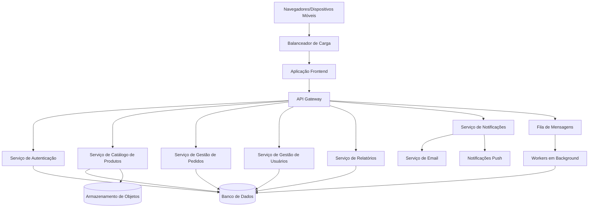

# Documento de Design: Plataforma B2B PulseHub

## Visão Geral

PulseHub é uma plataforma B2B que conecta fornecedores de moda e representantes comerciais, permitindo a gestão digital de catálogos, pedidos e relacionamentos comerciais. Este documento de design descreve a arquitetura técnica, componentes, modelos de dados e estratégias de implementação para a plataforma.

## Arquitetura

### Arquitetura do Sistema

O PulseHub será construído usando uma arquitetura moderna e escalável com os seguintes componentes principais:

1. **Aplicação Frontend**
   - Aplicação web construída com React.js
   - Recursos de Progressive Web App (PWA) para acessibilidade móvel
   - Design responsivo para interfaces desktop e móveis

2. **Serviços Backend**
   - API RESTful Node.js/Express.js
   - Arquitetura de microsserviços para escalabilidade
   - Serviço de autenticação usando tokens JWT
   - Serviço de catálogo de produtos
   - Serviço de gestão de pedidos
   - Serviço de gestão de usuários e clientes
   - Serviço de relatórios e análises
   - Serviço de notificações

3. **Camada de Banco de Dados**
   - Banco de dados principal: PostgreSQL para dados relacionais
   - Redis para cache e gerenciamento de sessões
   - Armazenamento de objetos (AWS S3 ou equivalente) para imagens de produtos e arquivos

4. **Camada de Integração**
   - API Gateway para integrações externas
   - Sistema de filas de mensagens (RabbitMQ) para processamento assíncrono
   - Sistema de webhooks para notificações em tempo real

### Arquitetura de Implantação

O sistema será implantado usando conteinerização para consistência entre ambientes:

- Contêineres Docker para todos os serviços
- Kubernetes para orquestração
- Pipeline de CI/CD para testes e implantação automatizados
- Ambientes separados para desenvolvimento, homologação e produção



## Componentes e Interfaces

### Componentes de Interface do Usuário

1. **Interfaces de Autenticação**
   - Tela de login
   - Formulário de registro
   - Fluxo de redefinição de senha
   - Autenticação multi-fator (opcional)

2. **Painel do Fornecedor**
   - Interface de gestão de produtos
   - Monitoramento de pedidos
   - Gestão de representantes
   - Configuração de comissões
   - Análise de desempenho

3. **Painel do Representante**
   - Gestão de clientes
   - Navegador de catálogo de produtos
   - Criação e gestão de pedidos
   - Acompanhamento de comissões
   - Calendário e agendamento

4. **Painel Administrativo**
   - Gestão de usuários
   - Configuração do sistema
   - Relatórios globais
   - Gestão de permissões

5. **Interface Móvel**
   - Catálogo de produtos otimizado para dispositivos móveis
   - Criação simplificada de pedidos
   - Acesso a informações de clientes
   - Capacidade de catálogo offline

### Endpoints da API

O sistema irá expor os seguintes endpoints principais da API:

1. API de Autenticação
POST /api/autenticacao/login – Fazer login
POST /api/autenticacao/registro – Registrar novo usuário
POST /api/autenticacao/redefinir-senha – Redefinir senha
GET /api/autenticacao/eu – Obter dados do usuário autenticado

2. API de Gestão de Usuários
GET /api/usuarios – Listar usuários
POST /api/usuarios – Criar usuário
GET /api/usuarios/:id – Obter detalhes de um usuário
PUT /api/usuarios/:id – Atualizar usuário
DELETE /api/usuarios/:id – Deletar usuário

3. API de Produtos
GET /api/produtos – Listar produtos
POST /api/produtos – Criar produto
GET /api/produtos/:id – Obter detalhes de um produto
PUT /api/produtos/:id – Atualizar produto
DELETE /api/produtos/:id – Deletar produto
GET /api/produtos/:id/variacoes – Listar variações do produto

4. API de Pedidos
GET /api/pedidos – Listar pedidos
POST /api/pedidos – Criar pedido
GET /api/pedidos/:id – Obter detalhes de um pedido
PUT /api/pedidos/:id – Atualizar pedido
DELETE /api/pedidos/:id – Deletar pedido
PUT /api/pedidos/:id/status – Atualizar status do pedido

5. API de Clientes
GET /api/clientes – Listar clientes
POST /api/clientes – Criar cliente
GET /api/clientes/:id – Obter detalhes de um cliente
PUT /api/clientes/:id – Atualizar cliente
DELETE /api/clientes/:id – Deletar cliente

6. API de Comissões
GET /api/comissoes – Listar comissões
POST /api/comissoes – Criar comissão
GET /api/comissoes/:id – Obter detalhes de uma comissão
PUT /api/comissoes/:id – Atualizar comissão

7. API de Relatórios
GET /api/relatorios/vendas – Relatório de vendas
GET /api/relatorios/produtos – Relatório de produtos
GET /api/relatorios/representantes – Relatório de representantes
GET /api/relatorios/clientes – Relatório de clientes

8. API de Notificações
GET /api/notificacoes – Listar notificações
PUT /api/notificacoes/:id/ler – Marcar como lida
PUT /api/notificacoes/preferencias – Atualizar preferências de notificação

## Modelos de Dados

### Modelo de Usuário

```json
{
  "id": "uuid",
  "email": "string",
  "hashSenha": "string",
  "nome": "string",
  "papel": "enum(ADMINISTRADOR, FORNECEDOR, REPRESENTANTE)",
  "empresa": "string",
  "telefone": "string",
  "endereco": {
    "rua": "string",
    "cidade": "string",
    "estado": "string",
    "cep": "string",
    "pais": "string"
  },
  "status": "enum(ATIVO, INATIVO, PENDENTE)",
  "criadoEm": "datetime",
  "atualizadoEm": "datetime",
  "ultimoAcesso": "datetime",
  "preferenciasNotificacao": {
    "email": "boolean",
    "noSistema": "boolean",
    "push": "boolean"
  }
}

```

### Modelo de Fornecedor

```json
{
  "id": "uuid",
  "usuarioId": "uuid",
  "razaoSocial": "string",
  "logo": "string",
  "descricao": "string",
  "cnpj": "string",
  "condicoesPagamento": "string",
  "valorMinimoPedido": "decimal",
  "percentualComissaoPadrao": "decimal",
  "representantes": ["uuid"],
  "categorias": ["string"],
  "criadoEm": "datetime",
  "atualizadoEm": "datetime"
}

```

### Modelo de Representante

```json
{
  "id": "uuid",
  "usuarioId": "uuid",
  "fornecedores": ["uuid"],
  "territorio": "string",
  "especialidades": ["string"],
  "clientes": ["uuid"],
  "percentualComissaoPadrao": "decimal",
  "criadoEm": "datetime",
  "atualizadoEm": "datetime"
}
```

### Modelo de Produto

```json
{
  "id": "uuid",
  "fornecedorId": "uuid",
  "nome": "string",
  "descricao": "string",
  "sku": "string",
  "categoria": "string",
  "subcategoria": "string",
  "imagens": ["string"],
  "precoBase": "decimal",
  "custo": "decimal",
  "status": "enum(ATIVO, INATIVO, DESCONTINUADO)",
  "atributos": {
    "material": "string",
    "peso": "decimal",
    "dimensoes": {
      "comprimento": "decimal",
      "largura": "decimal",
      "altura": "decimal"
    },
    "atributosPersonalizados": "object"
  },
  "variantes": ["uuid"],
  "criadoEm": "datetime",
  "atualizadoEm": "datetime"
}

```

### Modelo de Variante de Produto

```json
{
  "id": "uuid",
  "produtoId": "uuid",
  "sku": "string",
  "atributos": {
    "tamanho": "string",
    "cor": "string",
    "estilo": "string",
    "atributosPersonalizados": "object"
  },
  "preco": "decimal",
  "estoque": {
    "disponivel": "integer",
    "reservado": "integer",
    "entrada": "integer"
  },
  "imagens": ["string"],
  "status": "enum(ATIVO, INATIVO, DESCONTINUADO)",
  "criadoEm": "datetime",
  "atualizadoEm": "datetime"
}
```

### Modelo de Cliente

```json
{
  "id": "uuid",
  "representanteId": "uuid",
  "nome": "string",
  "nomeFantasia": "string",
  "cnpj": "string",
  "contato": "string",
  "email": "string",
  "telefone": "string",
  "endereco": {
    "rua": "string",
    "cidade": "string",
    "estado": "string",
    "cep": "string",
    "pais": "string"
  },
  "condicoesPagamento": "string",
  "limiteCredito": "decimal",
  "observacoes": "string",
  "etiquetas": ["string"],
  "criadoEm": "datetime",
  "atualizadoEm": "datetime"
}

```

### Modelo de Pedido

```json
{
  "id": "uuid",
  "numeroPedido": "string",
  "representanteId": "uuid",
  "fornecedorId": "uuid",
  "clienteId": "uuid",
  "status": "enum(RASCUNHO, ENVIADO, CONFIRMADO, PROCESSANDO, ENVIADO_PEDIDO, ENTREGUE, CANCELADO)",
  "itens": [
    {
      "produtoId": "uuid",
      "varianteId": "uuid",
      "quantidade": "integer",
      "precoUnitario": "decimal",
      "desconto": "decimal",
      "total": "decimal"
    }
  ],
  "subtotal": "decimal",
  "impostos": "decimal",
  "frete": "decimal",
  "desconto": "decimal",
  "total": "decimal",
  "percentualComissao": "decimal",
  "valorComissao": "decimal",
  "observacoes": "string",
  "enderecoEntrega": {
    "rua": "string",
    "cidade": "string",
    "estado": "string",
    "cep": "string",
    "pais": "string"
  },
  "enderecoCobranca": {
    "rua": "string",
    "cidade": "string",
    "estado": "string",
    "cep": "string",
    "pais": "string"
  },
  "condicoesPagamento": "string",
  "statusPagamento": "enum(PENDENTE, PARCIAL, PAGO)",
  "criadoEm": "datetime",
  "atualizadoEm": "datetime",
  "enviadoEm": "datetime",
  "confirmadoEm": "datetime",
  "enviadoPedidoEm": "datetime",
  "entregueEm": "datetime"
}

```

### Modelo de Comissão

```json
{
  "id": "uuid",
  "fornecedorId": "uuid",
  "representanteId": "uuid",
  "produtoId": "uuid",
  "categoriaId": "uuid",
  "percentual": "decimal",
  "vigenteDe": "date",
  "vigenteAte": "date",
  "padrao": "boolean",
  "criadoEm": "datetime",
  "atualizadoEm": "datetime"
}

```

### Modelo de Notificação

```json
{
  "id": "uuid",
  "usuarioId": "uuid",
  "tipo": "enum(STATUS_PEDIDO, ATUALIZACAO_PRODUTO, ATUALIZACAO_COMISSAO, SISTEMA)",
  "titulo": "string",
  "mensagem": "string",
  "referenciaId": "uuid",
  "tipoReferencia": "string",
  "lida": "boolean",
  "criadoEm": "datetime",
  "lidoEm": "datetime"
}

```

## Tratamento de Erros

### Formato de Resposta de Erro

Todos os erros da API seguirão um formato consistente:

```json
{
  "status": "inteiro",                  // Código HTTP de status (ex: 404, 500)
  "code": "texto",                     // Código interno de erro (ex: USUARIO_NAO_ENCONTRADO)
  "message": "texto",                  // Mensagem amigável descrevendo o erro
  "details": "objeto",                 // Detalhes técnicos adicionais, se houver
  "timestamp": "data-hora",           // Data e hora em que o erro ocorreu
  "path": "texto"                      // Caminho da requisição que gerou o erro
}

```

### Tipos de Erros

1. **Erros de Autenticação**
   - 401: Não autorizado - Credenciais inválidas
   - 403: Proibido - Permissões insuficientes

2. **Erros de Validação**
   - 400: Requisição inválida - Dados de entrada inválidos
   - 422: Entidade não processável - Violações de regras de negócio

3. **Erros de Recurso**
   - 404: Não encontrado - Recurso não existe
   - 409: Conflito - Conflito de estado do recurso

4. **Erros de Sistema**
   - 500: Erro interno do servidor - Erro inesperado do sistema
   - 503: Serviço indisponível - Sistema temporariamente indisponível

### Estratégia de Tratamento de Erros

1. **Tratamento de Erros no Frontend**
   - Mensagens de erro amigáveis ao usuário
   - Validação de formulários com feedback imediato
   - Mecanismos de retry para falhas de rede
   - Tratamento de erros no modo offline

2. **Tratamento de Erros no Backend**
   - Registro abrangente de erros
   - Respostas de erro estruturadas
   - Gerenciamento de transações para consistência de dados
   - Limitação de taxa e circuit breakers

3. **Monitoramento e Alertas**
   - Monitoramento da taxa de erros
   - Alertas para erros críticos
   - Detecção de degradação de desempenho

## Estratégia de Testes

### Níveis de Teste

1. **Testes Unitários**
   - Testes em nível de componente para todos os serviços
   - Mock de dependências externas
   - Meta de cobertura: 80%+

2. **Testes de Integração**
   - Teste de endpoints da API
   - Teste de interação com banco de dados
   - Teste de interação entre serviços

3. **Testes End-to-End**
   - Fluxos críticos de usuário
   - Testes cross-browser
   - Testes de responsividade móvel

4. **Testes de Desempenho**
   - Testes de carga para usuários concorrentes
   - Benchmarking de tempo de resposta
   - Otimização de consultas de banco de dados

5. **Testes de Segurança**
   - Testes de autenticação e autorização
   - Validação e sanitização de entrada
   - Verificação de vulnerabilidades em dependências

### Ferramentas de Teste

1. **Testes Unitários**
   - Jest para JavaScript/TypeScript
   - JUnit para componentes Java (se aplicável)

2. **Testes de API**
   - Postman para testes manuais
   - Supertest para testes automatizados de API

3. **Testes End-to-End**
   - Cypress para testes de aplicação web
   - Detox para testes de aplicação móvel

4. **Testes de Desempenho**
   - JMeter para testes de carga
   - Lighthouse para desempenho web

5. **Testes de Segurança**
   - OWASP ZAP para verificação de vulnerabilidades
   - npm audit / Snyk para verificação de dependências

## Considerações de Segurança

1. **Autenticação e Autorização**
   - Autenticação baseada em JWT
   - Controle de acesso baseado em funções
   - Autenticação multi-fator para operações sensíveis
   - Políticas de gerenciamento e timeout de sessão

2. **Proteção de Dados**
   - Criptografia de dados sensíveis em repouso
   - TLS para todos os dados em trânsito
   - Tratamento de PII de acordo com regulamentações
   - Princípios de minimização de dados

3. **Segurança da API**
   - Limitação de taxa
   - Configuração CORS
   - Validação e sanitização de entrada
   - Chaves de API para integrações externas

4. **Segurança de Infraestrutura**
   - Segmentação de rede
   - Configuração de firewall
   - Atualizações regulares de segurança
   - Detecção de intrusão

5. **Conformidade**
   - Conformidade com GDPR para usuários europeus
   - Conformidade com LGPD para usuários brasileiros
   - Regulamentações específicas da indústria conforme aplicável

## Escalabilidade e Desempenho

1. **Otimização de Banco de Dados**
   - Estratégia de indexação
   - Otimização de consultas
   - Pool de conexões
   - Estratégia de sharding para crescimento futuro

2. **Estratégia de Cache**
   - Redis para cache de aplicação
   - CDN para ativos estáticos
   - Políticas de cache do navegador

3. **Escalabilidade Horizontal**
   - Serviços stateless para fácil replicação
   - Balanceamento de carga
   - Auto-scaling baseado na demanda

4. **Otimização de Desempenho**
   - Otimização de imagens e carregamento lazy
   - Otimização de tamanho de bundle
   - Otimização de consultas de banco de dados
   - Processamento assíncrono para operações não críticas

## Pontos de Integração Futura

1. **Integração com ERP**
   - Formatos padronizados de troca de dados
   - Notificações de eventos baseadas em webhook
   - Capacidades de sincronização em lote
   - Tratamento de erros e reconciliação

2. **Processamento de Pagamentos**
   - Pontos de integração com gateway de pagamento
   - Gerenciamento do ciclo de vida da transação
   - Conformidade de segurança (PCI DSS)
   - Suporte a múltiplas moedas

3. **Logística e Envio**
   - Integração com API de provedores de envio
   - Troca de informações de rastreamento
   - Geração de etiquetas
   - Atualizações de status de entrega

4. **Análises e Business Intelligence**
   - Capacidades de exportação de dados
   - API de relatórios
   - Rastreamento de eventos para análises
   - Integração com painéis personalizados